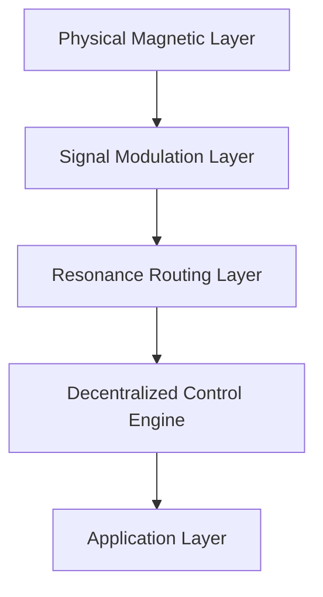

# Magnetic Resonance Network (MRN)
## Architecture Specification v1.0

---

# 1. Overview

Magnetic Resonance Network (MRN) คือสถาปัตยกรรมเครือข่ายแบบกระจายศูนย์ (Decentralized Network Architecture) ที่ใช้ “ความสอดคล้องของสนามแม่เหล็ก” (Magnetic Resonance) เป็นตัวกลางในการสื่อสาร แทนคลื่นวิทยุ แสง หรือโครงสร้างอินเทอร์เน็ตแบบดั้งเดิม

MRN ถูกออกแบบมาเพื่อทำงานได้แม้ในสภาพแวดล้อมที่เทคโนโลยีปัจจุบันไม่สามารถรองรับได้ เช่น ใต้น้ำ ใต้ดิน อุโมงค์ลึก เขตภัยพิบัติ หรืออวกาศ

## Core Design Principles

- Infrastructure-Free Communication  
- High Resilience  
- Full Decentralization  
- Stable Operation in RF-Noise Environments  

---

# 2. Vision

MRN มีเป้าหมายเพื่อ:

- สร้างเครือข่ายที่ไม่พึ่งพา Infrastructure ดั้งเดิม  
- รองรับการสื่อสารในพื้นที่ที่คลื่นวิทยุไม่เสถียร  
- ลด Single Point of Failure  
- เป็น Global Backup Network  
- รองรับ Space & Interplanetary Communication ในอนาคต  

---

# 3. High-Level Architecture

MRN แบ่งออกเป็น 5 ชั้นหลักดังนี้:

---

# 4. Core Components

---

## 4.1 Physical Magnetic Layer

### Responsibilities
- สร้างสนามแม่เหล็ก (Magnetic Field Generation)
- ตรวจจับสนามแม่เหล็ก (Field Detection)
- ควบคุมความถี่และรูปแบบสนามแม่เหล็ก
- จัดการพลังงานของโหนด (Energy Management)

### Characteristics
- สื่อสารทะลุสิ่งกีดขวางได้
- ทำงานในสภาพแวดล้อมใต้น้ำ/ใต้ดิน
- ใช้พลังงานสูง จำเป็นต้องมี Energy Optimization
- ต้องควบคุมเสถียรภาพของสนามแม่เหล็กอย่างต่อเนื่อง

---

## 4.2 Signal Modulation Layer

### Responsibilities
- แปลงข้อมูลดิจิทัล → รูปแบบสนามแม่เหล็ก
- ควบคุม Frequency / Phase / Amplitude
- ตรวจจับและแก้ไขสัญญาณรบกวน (Noise Handling)

### Example Techniques
- Frequency Shift Encoding
- Phase Resonance Encoding
- Error Correction Coding (ECC)
- Adaptive Modulation ตามสภาพแวดล้อม

---

## 4.3 Resonance Routing Layer

### Core Concept
“โหนดจะสื่อสารผ่านเส้นทางที่มี Resonance Stability สูงที่สุด”

### Responsibilities
- คำนวณ Resonance Score ของเพื่อนบ้าน
- เลือกเส้นทางที่เสถียรที่สุด
- หลีกเลี่ยงโหนดที่พลังงานต่ำ
- ปรับเส้นทางอัตโนมัติเมื่อโหนดล้มเหลว
- ลด Single Point of Failure

### Routing Strategy
- ใช้ Resonance Score + Energy Level เป็นตัวตัดสินใจ
- รองรับ Dynamic Topology
- รองรับ Store-and-Forward Mode

---

## 4.4 Decentralized Control Engine

### Characteristics
- ไม่มีศูนย์กลางควบคุม
- ทุกโหนดมีสถานะเท่าเทียมกัน (Peer-to-Peer)
- รองรับ Self-Healing Mechanism
- ตรวจจับความผิดปกติของโหนดแบบ Distributed

### Self-Healing Features
- ตรวจจับโหนดที่ล้มเหลว
- กระจายโหลดไปยังโหนดอื่น
- Rebalance Topology อัตโนมัติ
- ปรับเส้นทางใหม่แบบ Dynamic

---

## 4.5 Application Layer

### Responsibilities
- ให้บริการแอปพลิเคชันบนเครือข่าย MRN
- จัดการ data exchange ระดับผู้ใช้งาน
- ติดต่อระบบภายนอกผ่าน API
- แสดงผล / วิเคราะห์ข้อมูล
- กำหนด logic ของระบบ (monitoring, control, automation)
### Characteristics
- ไม่ขึ้นกับ hardware
- ใช้ abstraction จาก lower layers
-  รองรับหลาย application พร้อมกัน
-  สามารถ deploy distributed ได้

---

# 5. Communication Protocol

## Magnetic Resonance Transfer Protocol (MRTP)

### Transmission Flow
1. Encode Data → Magnetic Pattern
2. Encrypt ด้วย Resonance-Bound Key
3. เลือกเส้นทาง Resonance ที่เหมาะสมที่สุด
4. ส่งข้อมูลผ่าน Magnetic Modulation
5. ตรวจสอบ Integrity และ Resonance Signature
6. ส่ง Acknowledgement กลับผ่าน Resonance Pulse

### Supported Modes
- Time-Tolerant Communication
- Store-and-Forward Mode
- Low-Bandwidth Adaptive Mode
- Energy-Constrained Mode

---

# 6. Non-Functional Requirements

| Category | Requirement |
|------------|-------------|
| Scalability | เพิ่มโหนดได้โดยไม่ต้องมีศูนย์กลาง |
| Reliability | รองรับ Self-Healing |
| Security | Field-Bound Encryption |
| Energy Efficiency | ต้องมี Adaptive Energy Optimization |
| Latency | รองรับ Delay ระยะไกล |
| Interference Resistance | ทนต่อ RF Noise |

---

# 7. Limitations of Current Technologies

## 7.1 Field Generation Constraints
- ยังไม่สามารถสร้างสนามแม่เหล็กระยะไกลที่เสถียร
- ต้องใช้พลังงานสูง
- อุปกรณ์มีขนาดใหญ่

## 7.2 Data Rate Limitation
- Bandwidth ต่ำกว่า Fiber หรือ Radio
- ไม่เหมาะกับวิดีโอความละเอียดสูง

## 7.3 Security Limitation
- ไม่มีมาตรฐานเข้ารหัสเฉพาะ Magnetic Communication
- เสี่ยงต่อการรบกวนเชิงกายภาพ

## 7.4 Hardware & Cost
- เซนเซอร์แม่เหล็กความแม่นยำสูงมีราคาสูง
- ยังไม่รองรับ Mass Production

## 7.5 Energy Management
- สนามแม่เหล็กแรงสูงใช้พลังงานมาก
- ต้องพัฒนา Adaptive Power Control

## 7.6 Standardization
- ไม่มีโปรโตคอลสากล
- ยังอยู่ระดับแนวคิด/ทดลอง

---

# 8. Use Case Scenarios

## 8.1 Disaster & Crisis Communication
- ใช้งานได้แม้โครงสร้างอินเทอร์เน็ตล่ม
- ฟื้นฟูการสื่อสารขั้นพื้นฐานทันที
- ไม่ต้องพึ่งพาเสาสัญญาณ

## 8.2 Underwater & Underground Communication
เหมาะสำหรับ:
- เหมือง
- อุโมงค์
- สำรวจใต้ดิน
- ใต้น้ำ

## 8.3 Remote & Rural Areas
- ไม่ต้องลงทุนโครงสร้างพื้นฐานขนาดใหญ่
- ลด Digital Divide

## 8.4 Military & Secure Communication
- โอกาสถูกรบกวนน้อยกว่าคลื่นวิทยุ
- เหมาะกับงานด้านความมั่นคง

## 8.5 Global Backup Network
ทำหน้าที่เป็นเครือข่ายสำรองระดับโลกเมื่อ:
- ดาวเทียมล่ม
- อินเทอร์เน็ตล่ม
- โครงสร้างพื้นฐานเสียหาย

## 8.6 Space & Interplanetary Communication
- เครือข่ายระหว่างยานอวกาศ
- การสื่อสารในสภาพแวดล้อมอวกาศ
- รองรับ Interplanetary Architecture ในอนาคต

---

# 9. Future Extensions

- Quantum–Magnetic Hybrid Channel
- Autonomous Energy-Harvesting Nodes
- AI-Based Resonance Optimization
- Adaptive Self-Organizing Topology
- Autonomous Space Relay Nodes

---

# 10. Conclusion

Magnetic Resonance Network (MRN) เป็นแนวคิดเครือข่ายสื่อสารรูปแบบใหม่ที่ใช้สนามแม่เหล็กแทนคลื่นวิทยุและไม่ต้องพึ่งโครงสร้างพื้นฐานแบบดั้งเดิม

ระบบมีความทนทานสูง กระจายศูนย์เต็มรูปแบบ และสามารถทำงานได้ในสภาพแวดล้อมที่เครือข่ายปัจจุบันไม่สามารถเข้าถึงได้

MRN มีศักยภาพเป็นเครือข่ายสำรองระดับโลก และเป็นรากฐานของการสื่อสารในอนาคตทั้งบนโลกและในอวกาศ
